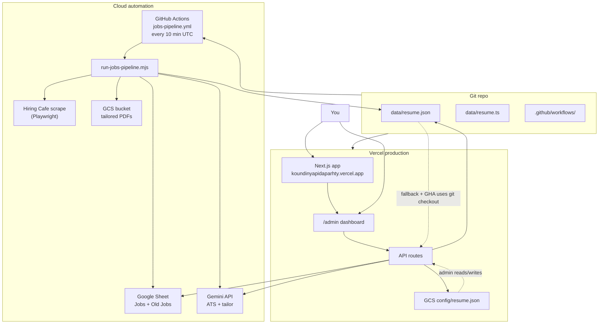
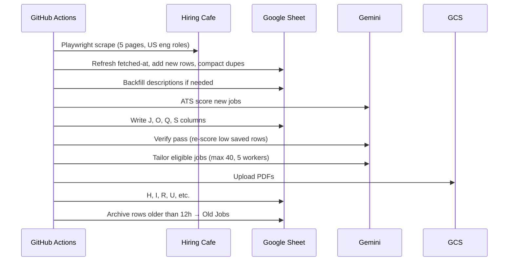
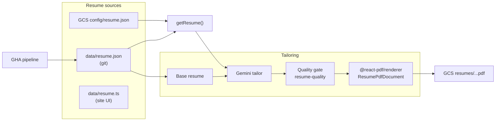
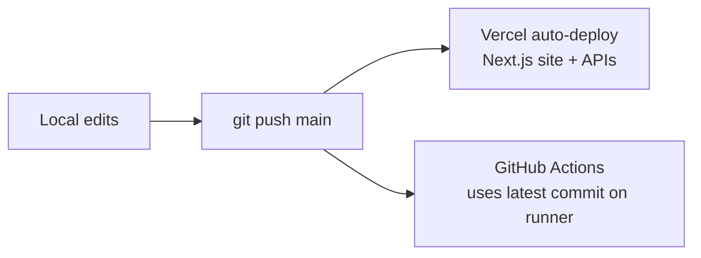

# System architecture

End-to-end map of **Koundinya Portfolio** — portfolio site, admin dashboard, Hiring Cafe jobs pipeline, resume tailoring, and how data flows between GitHub Actions, Vercel, Google Sheets, and GCS.

For day-to-day pipeline commands and cron setup, see [JOBS-PIPELINE.md](./JOBS-PIPELINE.md).

> **Note:** The `claude/` folder has older design notes. Some mention **Anthropic/Claude** — the **live pipeline uses Google Gemini only** (as of 2026). This doc reflects the current codebase.

---

## High-level picture



**Three places code runs:**

| Runtime | Role |
|---------|------|
| **GitHub Actions** | Scheduled job scrape + ATS + tailor (your Mac is off) |
| **Vercel** | Portfolio website + admin UI + on-demand APIs |
| **Local** | Dev, one-off `npm run job:*`, backfills |

---

## Repositories of truth

| Data | Primary source | Who reads it |
|------|----------------|--------------|
| **Job listings** | Google Sheet tab `Jobs` | GHA pipeline (read/write), admin `/api/jobs` (read) |
| **Archived jobs** | Google Sheet tab `Old Jobs` | Pipeline only |
| **Base resume (pipeline)** | `data/resume.json` in **git** (GHA checkout) | `scripts/lib/resume-loader.mjs` |
| **Base resume (website/admin)** | **GCS** `config/resume.json` if set, else `data/resume.json` | `lib/resumeStore.ts` |
| **Tailored PDFs per job** | **GCS** signed URLs in sheet column H | Admin download links |
| **Portfolio static copy** | `data/resume.ts` | Public site sections (Hero, About, etc.) |

**Important split:** Editing resume in **admin on Vercel** saves to **GCS**. The **10-minute pipeline on GitHub Actions** still loads **`data/resume.json` from the deployed commit**. To align them: **Export JSON** in admin → commit `data/resume.json` + `data/resume.ts` → push.

---

## AI models (current)

All LLM calls use **Google Gemini** via `generativelanguage.googleapis.com`.

| Setting | Default value | Used for |
|---------|---------------|----------|
| `GEMINI_MODEL` | `gemini-2.5-flash-lite` | Bulk ATS scoring on new jobs, portfolio chat, weekly summary |
| `GEMINI_TAILOR_MODEL` | `gemini-2.5-flash-lite` | Resume tailoring, post-tailor ATS, verify pass |
| `GEMINI_API_KEY` | (secret) | Auth for all Gemini calls |

**Fallback behavior:**

- If Gemini HTTP fails (503, etc.) → **local keyword ATS** (`scripts/lib/ats-scoring.mjs`)
- If tailor model 404 → tries fallback model from `tailorModelCandidates()`
- Tailor JSON parse failure → one automatic retry with stricter JSON prompt

**Not in use today:** Anthropic Claude (`@anthropic-ai/sdk` is not in `package.json`). Older docs in `claude/` describe a previous Claude-based path.

**Typical API calls per pipeline run (varies):**

1. **ATS score** — 1 Gemini call per *new* job (batch limit `HC_ATS_BATCH_LIMIT`, default 60)
2. **Verify pass** — re-score saved PDF rows below 90%
3. **Tailor loop** — up to **2 attempts** × (1 tailor + 1 score) per eligible job (batch limit `HC_TAILOR_BATCH_LIMIT`, default 40, concurrency 5)

---

## ATS & tailor thresholds

Defined in `lib/admin/atsConfig.ts` and `scripts/lib/ats-config.mjs` (keep in sync).

| Constant | Value | Meaning |
|----------|-------|---------|
| `SKIP_TAILOR_INITIAL_ATS` | 90 | Skip tailoring if **base** resume already ≥ 90% |
| `TAILOR_TARGET_SCORE` | 90 | Loop tries to reach this |
| `TAILOR_SAVE_MIN_SCORE` | 90 | Upload PDF + set `Resume Modified = yes` at or above this |
| `MAX_TAILOR_ATTEMPTS` | 2 | Max Gemini tailor attempts per job row |
| `MIN_SKILL_MATCH_COUNT` | 3 | Need ≥3 resume skills in JD description to tailor |
| `NON_TAILORED_MIN_SCORE` | 90 | Admin filter: “non-tailored” jobs with strong base match |

After max attempts without hitting 90% → **save best-effort** PDF (highest score seen).

**Never re-tailor:** rows with `Resume Modified = yes` **and** a URL in column H (`hasSavedResume`).

---

## Jobs pipeline (GitHub Actions)

### Trigger

```yaml
# .github/workflows/jobs-pipeline.yml
schedule: "*/10 * * * *"   # every 10 minutes UTC
workflow_dispatch:         # manual run from GitHub UI
concurrency: cancel-in-progress  # avoids stacked expensive runs
```

### Entry point

```
scripts/run-jobs-pipeline.mjs
  └── scripts/lib/jobs-pipeline-core.mjs
        ├── hiring-cafe-scraper.mjs      (Playwright → hiring.cafe)
        ├── hiring-cafe-sheet-sync.mjs   (dedupe, refresh, compact)
        ├── hiring-cafe-ats.mjs        (Gemini score new rows)
        ├── hiring-cafe-verify.mjs       (re-queue below 90%)
        └── hiring-cafe-tailor.mjs       (parallel tailor → PDF → sheet)
              ├── resume-tailor.mjs      (Gemini tailor loop)
              ├── gemini-ats.mjs         (Gemini scoring)
              ├── gcs-upload.mjs         (PDF upload)
              └── pdf-render-helper.cjs  (resume JSON → PDF)
```

### One run (scrape + tailor)



### Local equivalents

| npm script | Effect |
|------------|--------|
| `npm run job:pipeline` | Full pipeline (same as GHA) |
| `npm run job:pipeline:scrape` | `--scrape-only` |
| `npm run job:pipeline:tailor` | `--tailor-only` |
| `npm run job:retailor:all` | Backfill tailor for sheet rows below 90% |
| `npm run resume:pdf` | Regenerate `public/resume.pdf` from JSON |

Env loaded from `.env.local` via `scripts/lib/load-env.mjs`.

---

## Google Sheet schema (`Jobs` tab)

Columns **A–U** (21 cols in pipeline); admin API reads through **V** for skip flag.

| Col | Letter | Header | Written by |
|-----|--------|--------|------------|
| 0 | A | Company | Scraper |
| 1 | B | Title | Scraper |
| 2 | C | Location | Scraper |
| 3 | D | URL | Scraper |
| 4 | E | Category | Scraper |
| 5 | F | Fetched At | Scraper (refresh on re-seen) |
| 6 | G | Description | Scraper / backfill |
| 7 | H | Resume URL | Tailor → GCS signed URL |
| 8 | I | Cover Letter | Tailor |
| 9 | J | ATS Score | Gemini (post-tailor or base) |
| 10 | K | Apply Status | **You** (admin checkbox → `applied`) |
| 11 | L | Applied At | Admin |
| 12 | M | Notes | Legacy |
| 13 | N | Posted At | Scraper (ATS post date) |
| 14 | O | ATS Match Summary | Gemini |
| 15 | P | Key Gaps | Gemini |
| 16 | Q | Recommended Keywords | Gemini |
| 17 | R | Resume Modified | `yes` when PDF saved |
| 18 | S | Pre-Tailor ATS | Base score before tailor |
| 19 | T | Skill Match | Skill keyword count |
| 20 | U | Tailor Attempts | Cumulative attempt count |
| 21 | V | (skip apply) | Admin “skip” checkbox |

Rows older than **12 hours** (by `Fetched At`) move to **`Old Jobs`**.

---

## Vercel app (Next.js 14)

### Public site

- **Route:** `/` — portfolio (Hero, About, Skills, Projects, Experience, Contact)
- **Resume data:** mostly `data/resume.ts` at build time; `/api/resume` for dynamic reads
- **PDF download:** `/api/resume/pdf` or static `public/resume.pdf`

### Admin dashboard

- **Route:** `/admin` (NextAuth — admin session required for mutations)
- **Tabs:**
  - **Edit Resume** — live editor, preview, auto-save → `PUT /api/resume` → GCS
  - **Hiring Cafe Jobs** — reads sheet via `GET /api/jobs`, filters (active / applied / all), manual apply links
  - **Companies** — legacy company boards + manual tailor trigger

### API routes

| Route | Auth | Purpose |
|-------|------|---------|
| `GET /api/resume` | Public | Full resume JSON |
| `PUT /api/resume` | Admin | Save resume → GCS (+ local if writable) |
| `GET /api/resume/pdf` | Public | Generate PDF from current resume |
| `POST /api/resume/tailor` | Admin | One-off tailor for a job (Gemini) |
| `GET /api/jobs` | Admin session | Read Google Sheet jobs |
| `PATCH /api/jobs/apply-status` | Admin | Mark applied / not applied |
| `PATCH /api/jobs/skip-apply` | Admin | Skip job |
| `POST /api/chat` | Public | Portfolio chatbot (Gemini) |
| `POST /api/contact` | Public | Contact form email |
| `POST /api/internal/generate-and-store` | `x-internal-key` | Server tailor + PDF + GCS (Gemini) |
| `POST /api/cron/jobs-pipeline` | Cron secret | Optional API trigger (not on Vercel Hobby cron) |

---

## Resume & PDF pipeline



**Preview styling:** `app/admin/_components/ResumePreview.tsx`  
**PDF styling:** `lib/resumePdf.tsx` (should stay aligned)

---

## Environment variables

### GitHub Actions (jobs pipeline)

| Secret / env | Required |
|--------------|----------|
| `GOOGLE_SHEET_ID` | Yes |
| `GOOGLE_SERVICE_ACCOUNT_JSON` | Yes |
| `GEMINI_API_KEY` | Yes (skip tailor/ATS without) |
| `GEMINI_MODEL` | Set in workflow → `gemini-2.5-flash-lite` |
| `GEMINI_TAILOR_MODEL` | Same |
| `GCS_SERVICE_ACCOUNT_JSON` | Yes for PDF upload |
| `GCS_BUCKET_NAME` | Yes |
| `WHATSAPP_*` | Optional alerts |

### Vercel

| Variable | Purpose |
|----------|---------|
| `GOOGLE_SHEET_ID` + `GOOGLE_SERVICE_ACCOUNT_JSON` | Admin jobs tab |
| `GEMINI_API_KEY` | Chat, admin tailor |
| `GCS_*` | Resume save + PDFs |
| `NEXTAUTH_*` | Admin login |
| `NEXT_PUBLIC_SITE_URL` | Metadata |

### Local (`.env.local`)

Same keys as above; see `.env.example`.

---

## Deployment flow



- **Vercel:** `vercel --prod` or push to `main` (project: `koundinyapidaparhty`)
- **Pipeline:** Only GHA cron — **not** Vercel cron (Hobby plan limits)
- **Resume location updates:** Must be in git **and** optionally seeded to GCS for admin

---

## Admin job filters (Hiring Cafe tab)

| Filter | Behavior |
|--------|----------|
| **Active jobs** | Hides applied + skipped |
| **Applied jobs** | Only `Apply Status = applied` |
| **All jobs** | Everything in sheet |
| **Non-tailored (≥90%)** | Base resume strong match, no AI PDF yet |
| **All jobs** (resume) | Includes tailored rows |

Apply is **always manual** — open job URL, submit application, then check **Applied** in admin.

---

## Cost levers (why things are configured this way)

| Choice | Reason |
|--------|--------|
| Single GHA workflow (not scrape + tailor separate) | Half the Actions minutes |
| `cancel-in-progress: true` | No stacked 15-min runs |
| `gemini-2.5-flash-lite` | Cheapest Gemini tier for volume |
| `MAX_TAILOR_ATTEMPTS = 2` | Fewer API calls per job |
| `HC_TAILOR_BATCH_LIMIT = 40` | Cap tailor work per 10-min tick |
| Skip rows with saved PDF | No repeat tailor cost |
| `hasSavedResume` lock | Same |

---

## Key files index

| Area | Path |
|------|------|
| Pipeline entry | `scripts/run-jobs-pipeline.mjs` |
| Pipeline core | `scripts/lib/jobs-pipeline-core.mjs` |
| ATS config | `scripts/lib/ats-config.mjs`, `lib/admin/atsConfig.ts` |
| Gemini scoring | `scripts/lib/gemini-ats.mjs` |
| Gemini tailoring | `scripts/lib/resume-tailor.mjs`, `lib/resumeTailor.ts` |
| Tailor eligibility | `scripts/lib/tailor-eligibility.mjs` |
| Sheet scrape/write | `scripts/scrape-jobs.mjs`, `scripts/lib/hiring-cafe-*.mjs` |
| GHA workflow | `.github/workflows/jobs-pipeline.yml` |
| Resume store | `lib/resumeStore.ts` |
| Admin jobs UI | `app/admin/_components/AllJobsTab.tsx` |
| Admin resume UI | `app/admin/_components/EditResumeTab.tsx` |
| Job filters logic | `lib/admin/allJobsFilters.ts` |

---

## Related docs

| Doc | Contents |
|-----|----------|
| [JOBS-PIPELINE.md](./JOBS-PIPELINE.md) | Cron setup, secrets, commands, troubleshooting |
| [ATS-TAILOR-PIPELINE.md](./ATS-TAILOR-PIPELINE.md) | ATS scoring, verify pass, tailor loop, Gemini prompts |
| [DEPLOY-READINESS.md](./DEPLOY-READINESS.md) | Pre-deploy checklist |
| `claude/INDEX.md` | Older granular docs (verify against this file) |

---

## Future changes (not implemented)

- **Anthropic provider** — would need a shared LLM adapter; docs previously described Claude
- **Pipeline reads GCS resume** — would sync admin edits with GHA without git commit
- **100% ATS target** — scoring is LLM-estimated; 90% + good-fit jobs is the practical goal
- **Auto-apply** — intentionally out of scope; manual apply only
