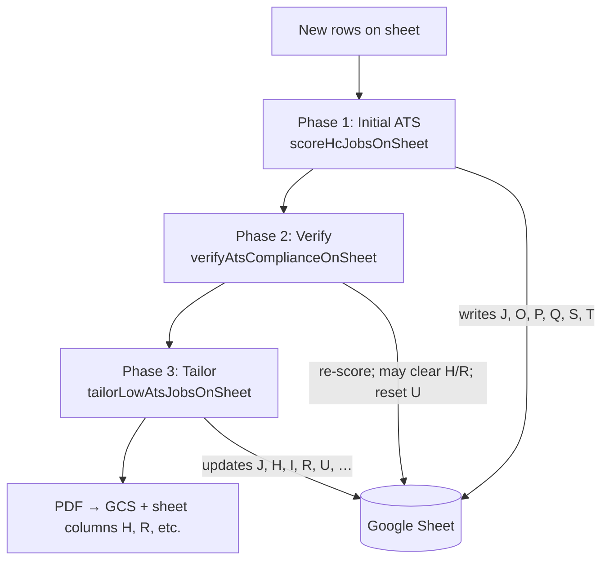

# ATS scoring, verification & tailor loop

How this repo scores resumes against job descriptions, re-verifies scores, and runs the AI tailor loop — including **exactly what we send to Gemini** and **what we expect back**.

Related: [ARCHITECTURE.md](./ARCHITECTURE.md) · [JOBS-PIPELINE.md](./JOBS-PIPELINE.md)

**Model (current):** `gemini-2.5-flash-lite` via `GEMINI_MODEL` / `GEMINI_TAILOR_MODEL`  
**API:** `POST https://generativelanguage.googleapis.com/v1beta/models/{model}:generateContent?key=...`

---

## Pipeline order (one GHA run)



| Phase | Script | When it runs |
|-------|--------|--------------|
| **1. Initial ATS** | `scripts/lib/hiring-cafe-ats.mjs` | Rows with description ≥120 chars and **empty** column J |
| **2. Verify** | `scripts/lib/hiring-cafe-verify.mjs` | Rows below 90%, or rows with saved PDF / URL |
| **3. Tailor** | `scripts/lib/hiring-cafe-tailor.mjs` | Eligible rows via `needsTailoring()` (batch limit 40, concurrency 5) |

All phases use **`data/resume.json`** from the git checkout on GitHub Actions (`loadResume()`).

---

## Thresholds (config)

From `scripts/lib/ats-config.mjs` / `lib/admin/atsConfig.ts`:

| Constant | Value | Role |
|----------|-------|------|
| `TAILOR_SAVE_MIN_SCORE` | 90 | Save PDF when post-tailor score ≥ this |
| `TAILOR_TARGET_SCORE` | 90 | Tailor loop target (same as save min) |
| `SKIP_TAILOR_INITIAL_ATS` | 90 | Skip tailor if **base** score already ≥ 90 |
| `MAX_TAILOR_ATTEMPTS` | 2 | Max outer tailor attempts per job (column U) |
| `MIN_SKILL_MATCH_COUNT` | 3 | Need ≥3 resume skills found in JD text |

---

## What we send: resume payload

### For ATS scoring (Gemini)

**File:** `scripts/lib/resume-ats-context.mjs`

We do **not** send the full resume JSON. We send a **condensed summary** capped at **2,500 characters**:

```json
{
  "title": "",
  "summary": "Software engineer with 3+ years…",
  "skills": ["React", "Next.js", "TypeScript", "…"],
  "experience": [
    {
      "role": "Software Engineer",
      "company": "Anchor Operating System",
      "technologies": ["Next.js 14", "TypeScript", "…"],
      "points": ["Architected and shipped…", "…"]
    }
  ],
  "projects": [
    { "name": "…", "stack": ["…"], "description": "…" }
  ]
}
```

If JSON exceeds 2,500 chars, we progressively truncate summary, bullets, project text, then drop to minimal fields.

**Job description:** up to **12,000 characters** (sheet column G cap).

### For tailoring (Gemini)

**File:** `scripts/lib/resume-tailor.mjs` → `buildTailorPrompt()`

We send the **full base resume JSON** in the prompt:

```
CANDIDATE'S BASE RESUME:
{ ... entire resume object ... }
```

Job description in tailor prompt: **first 6,000 characters** of column G.

Refine prompts use draft + base resume; JD truncated to **4,000 chars** in refine step.

### Fallback (no Gemini)

**File:** `scripts/lib/ats-scoring.mjs` (keyword overlap)

Uses `buildResumeAtsPayload()` → flattened text from summary, skills, experience bullets, projects. No API call.

---

## Phase 1: Initial ATS scoring

**Function:** `scoreJobWithGemini()` in `scripts/lib/gemini-ats.mjs`  
**Called from:** `scoreHcJobsOnSheet()` — uses default model (`GEMINI_MODEL`, not `useTailorModel`)

### Eligibility

- Column G (description) ≥ 120 characters  
- Column J (ATS score) **empty**

### Request to Gemini

**HTTP:**

```http
POST /v1beta/models/gemini-2.5-flash-lite:generateContent?key={GEMINI_API_KEY}
Content-Type: application/json
```

**Body:**

```json
{
  "contents": [{ "parts": [{ "text": "<ATS prompt below>" }] }],
  "generationConfig": {
    "temperature": 0.1,
    "maxOutputTokens": 1024,
    "responseMimeType": "application/json"
  }
}
```

**Prompt (text part):**

```
You are an ATS matcher. Score how well this resume matches the job (0-100 integer).
Return JSON: {
  "score": number,
  "label": "high"|"medium"|"low",
  "matched": string[],
  "missing": string[],
  "matchSummary": "1-2 sentences on fit",
  "keyGaps": string[],
  "recommendedKeywords": string[]
}
high >= 75, medium >= 35, low < 35. recommendedKeywords = top terms to add to resume for this role.

Job title: {title}

Complete job description:
{description up to 12k chars}

Resume summary (summary paragraph, experience bullets, skills, roles, technologies, projects):
{condensed resume JSON string}
```

### Expected response

Gemini returns JSON (parsed from `candidates[0].content.parts[0].text`):

| Field | Use |
|-------|-----|
| `score` | 0–100 → sheet **J**, also drives tailor eligibility |
| `matchSummary` | Sheet **O** |
| `keyGaps` | Sheet **P** (comma-joined if array) |
| `recommendedKeywords` | Sheet **Q** |
| `matched` / `missing` | Used internally; not separate columns |

Also written on initial score:

| Column | Value |
|--------|--------|
| **S** (Pre-Tailor ATS) | Same as first score (base resume) |
| **T** (Skill Match) | Local keyword count (resume skills in JD) |
| **R** (Resume Modified) | `no` if score ≥ 90, else empty |

### On failure

- HTTP error / timeout / parse error → **local keyword ATS** (`source: "local-keywords"`)
- Log: `Gemini ATS HTTP 503 — using local keywords`

---

## Phase 2: ATS verification

**Function:** `verifyAtsComplianceOnSheet()` in `scripts/lib/hiring-cafe-verify.mjs`

Re-scores rows that might be stale or incorrectly “saved” below 90%.

### Which rows get verified

A row is checked if **all** of:

- Description ≥ 120 chars  
- Not marked applied (column K)  
- **And** any of:
  - Current score (J) **< 90%**
  - `Resume Modified` (R) is yes **or** Resume URL (H) is set  

Also requires **≥3 skill matches** (same gate as tailoring).

### Request

Same as Phase 1, but:

```js
scoreJobWithGemini(title, desc, resume, { useTailorModel: true })
```

Uses `GEMINI_TAILOR_MODEL` (with fallback to `GEMINI_MODEL` on 404).

### What verify **does** with the result

| Condition | Action |
|-----------|--------|
| New score ≠ old score | Update **J, O, P, Q** |
| New score **< 90%** and **no** locked saved PDF | Set **U** (attempts) to `0` → **re-queue for tailor** |
| New score **< 90%** but had H/R set | **Clear H and R** (remove stale “saved” state) + re-queue |

Locked saved PDF = `R=yes` **and** URL in H (`hasSavedResume`) — verify **will not** clear those.

Log example: `Verify: 54 checked, 54 below 90%, 3 re-queued`

---

## Phase 3: Tailor loop

### 3a. Eligibility (`needsTailoring`)

**File:** `scripts/lib/tailor-eligibility.mjs`

Skip if:

- Description < 120 chars  
- Applied (K = `applied`)  
- **`hasSavedResume`**: R=yes **and** H has URL → **never re-tailor**  
- Base pre-tailor score (S or J) ≥ 90 **and** not a “stuck upload” case  
- Post score ≥ 90 and not stuck  
- Tailor attempts (U) ≥ `MAX_TAILOR_ATTEMPTS` (2)  
- Skill match count < 3  

**Stuck upload:** score ≥ 90 but no PDF URL and R≠yes → allow retry if attempts remain.

### 3b. Outer loop (`tailorResumeUntilTarget`)

**File:** `scripts/lib/resume-tailor.mjs`

Per job, up to **`remaining = MAX_TAILOR_ATTEMPTS - prevAttempts`** iterations (column U is cumulative across runs).

```
for each attempt (max 2 by default):
  1. Run tailorResumeWithQualityGate (see 3c)
  2. Keep best draft by highest postAtsScore (never replace with lower score)
  3. If best score >= 90 → stop early
  4. Else wait 1.5s and retry with ATS gap guidance on prior draft
```

After loop:

- **≥ 90%** → save PDF  
- **< 90%** but attempts exhausted → **save best-effort** PDF anyway (`saveBestEffort`)

### 3c. Inner pass (`tailorResumeWithQualityGate`)

Each outer attempt can trigger **multiple Gemini calls**:

```mermaid
sequenceDiagram
  participant Loop as Outer loop
  participant Gate as tailorResumeWithQualityGate
  participant G as Gemini
  participant Score as scoreJobWithGemini

  Loop->>Gate: attempt 1 (from base)
  Gate->>G: buildTailorPrompt → full resume JSON
  G-->>Gate: tailored JSON + coverLetter
  Gate->>Score: score tailored resume
  Score-->>Gate: postAtsScore, keyGaps, keywords
  Gate->>Gate: validateTailoredResume

  alt score < 90 OR quality failed
    Gate->>G: buildRefinePrompt (draft + feedback + gaps)
    G-->>Gate: revised JSON
    Gate->>Score: re-score
    Gate->>Gate: validate again
  end

  Loop->>Gate: attempt 2 (refine best draft + ATS guidance)
  Note over Gate,G: buildRefinePrompt with keyGaps/keywords from best score
```

#### Tailor request (first call)

**HTTP:** same endpoint, different config:

```json
{
  "generationConfig": {
    "temperature": 0.2,
    "maxOutputTokens": 8192,
    "responseMimeType": "application/json"
  }
}
```

**Prompt asks for:**

- Rewrite `personalInfo.summary` (2–3 sentences, company-specific)  
- Reorder skills  
- Rephrase experience bullets (JD language, **only existing facts**)  
- Leave education, project names, dates, companies unchanged  
- `personalInfo.title` must be **empty**  
- **coverLetter** (3 paragraphs)  
- Output: **only JSON**, schema includes full resume + `coverLetter`

**Expected JSON shape:**

```json
{
  "personalInfo": { "name", "email", "phone", "location", "linkedin", "github", "portfolio", "summary", "title": "" },
  "education": [ "unchanged structure" ],
  "experience": [ "same ids/companies/dates, tailored points[]" ],
  "skills": [ "reordered categories" ],
  "projects": [ "unchanged" ],
  "coverLetter": "paragraphs separated by \\n\\n"
}
```

Post-processing:

1. `normalizeParsedTailorResponse()` — fix malformed Gemini shapes  
2. `sanitizeTailoredResume()` — strip invented skills, clamp to base facts  
3. Force `personalInfo.title = ""`

#### Refine request (optional, same attempt)

Triggered when:

- `postAtsScore < 90` **or** `validateTailoredResume` has **errors**  
- And this is **not** already an outer-loop retry (`isRetryAttempt`)

Sends `buildRefinePrompt` with quality feedback + ATS gaps from score step.

#### Score after tailor

Same ATS prompt as Phase 1, with `{ useTailorModel: true }`, but resume = **tailored** JSON (condensed summary form).

#### Quality gate (`validateTailoredResume`)

**File:** `scripts/lib/resume-quality.mjs`

| Check | Severity |
|-------|----------|
| Headline title under name | warning |
| Summary too short/long | warning |
| Summary doesn’t mention company | warning |
| AI buzzwords in resume/cover letter | warning |
| Experience/education/project structure changed | warning |
| Invented skills not in base resume | warning |
| ATS didn’t improve (+5) and didn’t hit 90 | **error** |
| ATS below 90 after tailor | **error** |

`passed = (errors.length === 0)`. Warnings alone don’t fail, but can trigger refine if combined with low ATS.

### 3d. Outer attempt 2+

If attempt 1 didn’t reach 90%, attempt 2 uses **refine path** with `buildAtsTargetGuidance()`:

- Injects previous **keyGaps**, **recommendedKeywords**, **matched**  
- Extra instructions if score 80–89 (“CLOSE TO TARGET”)  
- Sends **best draft resume** + guidance (not fresh from base)

### 3e. Save to sheet & GCS

If `reachedTarget` (≥90% **or** best-effort after exhausted attempts):

1. Render PDF: `pdf-render-helper.cjs` ← tailored resume JSON  
2. Upload: `GCS` → `resumes/{date}/{Company}_{Title}.pdf`  
3. Batch-update sheet:

| Column | Content |
|--------|---------|
| **H** | Signed GCS URL |
| **I** | Cover letter (max 4000 chars) |
| **J** | Post-tailor ATS score |
| **O–Q** | matchSummary, keyGaps, recommendedKeywords |
| **R** | `yes` if upload succeeded, else `no` |
| **S** | Pre-tailor score (preserved) |
| **T** | Skill match count |
| **U** | Total tailor attempts |

PDF is only marked saved (**R=yes**) when GCS upload succeeds.

---

## Gemini call budget (typical job)

Rough **minimum / maximum** Gemini calls per job:

| Stage | Calls |
|-------|-------|
| Initial ATS (once per new row) | 1 |
| Verify (if row qualifies) | 0–1 per pipeline run |
| **One tailor attempt** | 1 tailor + 1 score + 0–1 refine + 0–1 re-score ≈ **2–4** |
| **Two outer attempts** | ≈ **4–8** tailor-related calls |

With `MAX_TAILOR_ATTEMPTS=2` and refine inside each attempt, a hard job can use **many** API calls — main cost driver.

---

## Skill match gate (non-LLM)

**File:** `scripts/lib/skill-match.mjs`

Before verify/tailor:

1. Collect skills from resume `skills[]`, experience `technologies[]`, project `stack[]`  
2. Count how many appear in job description (substring / word-boundary match)  
3. Require **count ≥ 3** (`MIN_SKILL_MATCH_COUNT`)

This prevents tailoring (and verify) for completely unrelated JDs without spending Gemini tokens.

---

## Sheet columns touched by ATS/tailor

| Col | Name | Phase 1 | Verify | Tailor |
|-----|------|---------|--------|--------|
| G | Description | (scrape) | read | read |
| H | Resume URL | — | clear if stale | set PDF URL |
| I | Cover Letter | — | — | set |
| J | ATS Score | **set** | update | update |
| O | Match Summary | **set** | update | update |
| P | Key Gaps | **set** | update | update |
| Q | Recommended Keywords | **set** | update | update |
| R | Resume Modified | set `no` if ≥90 | clear if stale | `yes`/`no` |
| S | Pre-Tailor ATS | **set** | — | preserve |
| T | Skill Match | **set** | — | update |
| U | Tailor Attempts | — | reset `0` if re-queue | increment |

---

## Admin / API (same logic)

| Entry | Tailor engine | Scoring |
|-------|---------------|---------|
| GHA pipeline | `scripts/lib/resume-tailor.mjs` | `scripts/lib/gemini-ats.mjs` |
| `POST /api/resume/tailor` | `lib/resumeTailor.ts` | Gemini via same prompts |
| `POST /api/internal/generate-and-store` | `lib/resumeTailor.ts` | Same |

Admin one-off tailor uses the same prompt patterns; it does **not** run the full outer loop unless you invoke the pipeline.

---

## Environment variables

| Variable | Effect |
|----------|--------|
| `GEMINI_API_KEY` | Required for ATS + tailor (skip phases if missing) |
| `GEMINI_MODEL` | Initial ATS scoring, fallback model |
| `GEMINI_TAILOR_MODEL` | Verify + post-tailor score + tailor calls |
| `HC_ATS_BATCH_LIMIT` | Max new rows to score per run (default 60) |
| `HC_TAILOR_BATCH_LIMIT` | Max jobs to tailor per run (default 40) |
| `HC_TAILOR_CONCURRENCY` | Parallel tailor workers (default 5) |
| `HC_TAILOR_DELAY_MS` | Delay between sequential tailors (default 2000) |

---

## Key source files

| Concern | Path |
|---------|------|
| ATS API + prompt | `scripts/lib/gemini-ats.mjs` |
| Resume context for scoring | `scripts/lib/resume-ats-context.mjs` |
| Keyword fallback | `scripts/lib/ats-scoring.mjs` |
| Initial sheet scoring | `scripts/lib/hiring-cafe-ats.mjs` |
| Verify pass | `scripts/lib/hiring-cafe-verify.mjs` |
| Tailor loop + prompts | `scripts/lib/resume-tailor.mjs` |
| Quality + sanitize | `scripts/lib/resume-quality.mjs` |
| Eligibility | `scripts/lib/tailor-eligibility.mjs` |
| Sheet orchestration | `scripts/lib/hiring-cafe-tailor.mjs` |
| Thresholds | `scripts/lib/ats-config.mjs` |
| Next.js mirror | `lib/resumeTailor.ts`, `lib/resumeQuality.ts` |

---

## Limitations (important)

1. **Score is LLM-estimated**, not a real Greenhouse/Workday ATS parser. Same resume can score differently run-to-run.  
2. **100% is not guaranteed** — especially on manager roles, niche stacks, or low base fit.  
3. **Saved PDF lock** — once R=yes + H has URL, pipeline never re-tailors; update resume in git/GCS and clear columns to refresh.  
4. **Pipeline resume vs admin resume** — GHA uses git `data/resume.json`; Vercel admin may save to GCS (`config/resume.json`). Keep them in sync via Export JSON + commit.  
5. **Best-effort saves** — after 2 attempts, we may save a PDF below 90% so you still have something to review.
