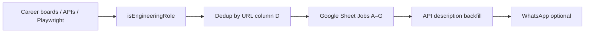

# Jobs pipeline (scrape-only)

This project **scrapes engineering job listings** into a Google Sheet. Auto-apply, resume generation, and form-intelligence pipelines have been removed.

**Source of truth:** Google Sheet (`GOOGLE_SHEET_ID`) → tab **`Jobs`** (active) and **`Old Jobs`** (archived after ~48 hours).

---

## Overview



| Stage | Script | npm command |
|-------|--------|-------------|
| **Scrape** | `scripts/scrape-jobs.mjs` | `npm run scrape` or `npm run job:scrape` |
| **Deep enrich** (Playwright) | `scripts/enrich-descriptions.mjs` | `npm run job:enrich-descriptions` |
| **Diagnose sheet** | `scripts/diagnose-sheet.mjs` | `npm run job:diagnose` |
| **Env check** | `scripts/validate-pipeline-env.mjs` | `npm run job:validate-env` |

**GitHub Actions:** `.github/workflows/scrape-jobs.yml` runs every 30 minutes (4 AM–6 PM PDT window).

---

## Scrape filters

| Filter | Rule |
|--------|------|
| **Role title** | `isEngineeringRole()` — keyword match (configurable via `ENGINEERING_KEYWORDS` or disable with `ENGINEERING_FILTER=off`) |
| **Dedup** | Skip if URL (column D) already exists in `Jobs` |
| **Description** | Fetched for new rows; `backfillDescriptions()` fills empty column G |

### Sheet columns

| Col | Field | Set by |
|-----|-------|--------|
| A–G | Company, Title, Location, URL, Category, Fetched At, Description | Scraper |
| H–M | Resume URL, Cover Letter, ATS Score, Apply Status, Applied At, Notes | Legacy (left empty on new rows) |

---

## Platforms

**Active:** Greenhouse, Workday, Lever, Ashby, SmartRecruiters, iCIMS (Disney), Booking.com, Hiring.cafe (Playwright), Amazon / Google / Meta / Apple custom APIs.

**Implemented, not wired** (add to `fetchAllJobs()` when you have a board slug):

- **Workable** — `fetchWorkable(slug)` → `apply.workable.com` widget API
- **BreezyHR** — `fetchBreezyHR(slug)` → `{slug}.breezy.hr/json`
- **Recruitee** — `fetchRecruitee(slug)` → `{slug}.recruitee.com/api/offers/`

**Blocked / skipped:** Universal Studios (Cloudflare), Flywire (no public board), some Workday boards in `NO_DESCRIPTION_COMPANIES`.

Companies and adapters are defined in `scripts/scrape-jobs.mjs` → `fetchAllJobs()`.

---

## Environment

Required:

- `GOOGLE_SHEET_ID`
- `GOOGLE_SERVICE_ACCOUNT_JSON`

Optional:

- `WHATSAPP_PHONE_NUMBER_ID`, `WHATSAPP_ACCESS_TOKEN`, `WHATSAPP_RECIPIENT` — new-job alerts
- `DRY_RUN=true` — fetch + summary only; no writes
- `ENGINEERING_FILTER=off` — disable title keyword filter
- `ENGINEERING_KEYWORDS` — comma-separated custom keywords
- `ENRICH_PLAYWRIGHT=true` — after scrape, run `enrich-descriptions.mjs`

---

## Local commands

```bash
npm run job:validate-env
npm run scrape:dry          # DRY_RUN — no sheet writes
npm run scrape
npm run job:enrich-descriptions
npm run job:diagnose
```

---

## Archived docs

- [FORM-DATA-COLLECTION.md](./FORM-DATA-COLLECTION.md) — apply/form capture (removed from codebase)
- [APPLICANT-MEMORY.md](./APPLICANT-MEMORY.md) — applicant memory for auto-apply (removed from codebase)

Historical captures under `data/form-intelligence/` are kept on disk but no longer referenced by scripts.
