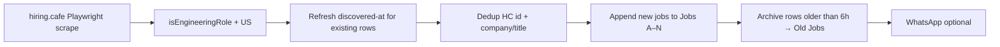

# Jobs pipeline (Hiring Cafe only)

This project **scrapes engineering job listings from Hiring Cafe** into a Google Sheet. Auto-apply, resume generation, and form-intelligence pipelines have been removed.

**Source of truth:** Google Sheet (`GOOGLE_SHEET_ID`) → tab **`Jobs`** (active apply-now window) and **`Old Jobs`** (archived after ~6 hours).

**Production mode:** Hiring Cafe only — Engineering + Software Development departments, jobs posted within the last 2 days. Legacy multi-portal scraping (`companies.json`) is disabled unless `ALLOW_LEGACY_SCRAPE=1`.

---

## Overview



| Stage | Script | npm command |
|-------|--------|-------------|
| **HC pipeline** (default) | `scripts/run-hiring-cafe-pipeline.mjs` | `npm run job:pipeline` |
| **Local 10-min loop** | `scripts/run-hiring-cafe-loop.mjs` | `npm run job:pipeline:loop` |
| **Purge legacy rows** | `scripts/purge-jobs-sheet.mjs` | `npm run job:purge` |
| **Diagnose sheet** | `scripts/diagnose-sheet.mjs` | `npm run job:diagnose` |
| **Env check** | `scripts/validate-pipeline-env.mjs` | `npm run job:validate-env` |
| **Legacy multi-portal** (manual only) | `scripts/run-full-pipeline.mjs` | `ALLOW_LEGACY_SCRAPE=1 npm run job:pipeline:companies` |

**GitHub Actions:** `.github/workflows/scrape-jobs.yml` runs the HC pipeline every 10 minutes, 24/7.

---

## Hiring Cafe scrape config

| Setting | Value |
|---------|--------|
| Search URL | `https://hiring.cafe/?searchState=…` — Engineering + Software Development, last 2 days, sorted by date (no HC `locations` filter) |
| US filter | Applied after scrape via `isUsHcJob` (admin defaults to US-only) |
| Departments | Engineering, Software Development |
| Date window | Last 2 days (`dateFetchedPastNDays: 2`) |
| Apply-now window | Jobs tab keeps discoveries from last 6 hours |
| Dedup | HC job id + company/title vs `Jobs` + `Old Jobs`; sheet compact each run |
| Refresh | Existing rows get column F updated every scrape (last discovered) |
| Schedule | GHA every 10 min; admin filters include 10m / 20m / 30m windows |
| Pagination | Pages 1–5 each run via HC `&page=` param (0-based) |
| Descriptions | Full text from HC job detail API (`job_information.description`) |
| ATS | Gemini scores resume vs description → columns J, O–Q |

Config lives in `scripts/lib/hiring-cafe.mjs`.

---

## Sheet columns

| Col | Field | Set by |
|-----|-------|--------|
| A–G | Company, Title, Location, URL, Category, Fetched At, Description | Scraper (full description from HC Job Description tab) |
| H–M | Resume URL, Cover Letter, ATS Score, Apply Status, Applied At, Notes | Pipeline / legacy |
| N | Posted At | Scraper (HC API / relative DOM times) |
| O | ATS Match Summary | Gemini ATS analysis |
| P | Key Gaps | Gemini ATS analysis |
| Q | Recommended Keywords | Gemini ATS analysis |

---

## One-time purge (legacy → HC-only)

When migrating from multi-portal rows to HC-only:

```bash
DRY_RUN=true npm run job:purge              # preview row counts
npm run job:purge -- --clear-dedup          # backup Jobs → Old Jobs, clear Jobs, wipe Old Jobs dedup
npm run job:pipeline                        # fresh HC scrape
npm run job:diagnose                        # confirm ~hundreds of hiring-cafe rows
```

`--clear-dedup` wipes `Old Jobs` so previously archived URLs can be re-imported.

---

## Environment

Required:

- `GOOGLE_SHEET_ID`
- `GOOGLE_SERVICE_ACCOUNT_JSON`

Optional:

- `WHATSAPP_PHONE_NUMBER_ID`, `WHATSAPP_ACCESS_TOKEN`, `WHATSAPP_RECIPIENT` — new-job alerts
- `DRY_RUN=true` — fetch + summary only; no writes
- `ALLOW_LEGACY_SCRAPE=1` — required to run `job:pipeline:companies` (multi-portal legacy scrape)

---

## Local commands

```bash
npm run job:validate-env
npm run job:pipeline:hc:dry     # DRY_RUN — no sheet writes
npm run job:pipeline            # HC scrape + sheet update
npm run job:purge:dry           # preview purge counts
npm run job:diagnose
```

---

## Admin API

`GET /api/jobs` returns **Hiring Cafe rows only** by default (`category === "hiring-cafe"` or URL contains `hiring.cafe`).

For debugging legacy rows: `GET /api/jobs?includeLegacy=true`.

---

## Archived docs

- [FORM-DATA-COLLECTION.md](./FORM-DATA-COLLECTION.md) — apply/form capture (removed from codebase)
- [APPLICANT-MEMORY.md](./APPLICANT-MEMORY.md) — applicant memory for auto-apply (removed from codebase)

Historical captures under `data/form-intelligence/` are kept on disk but no longer referenced by scripts.
